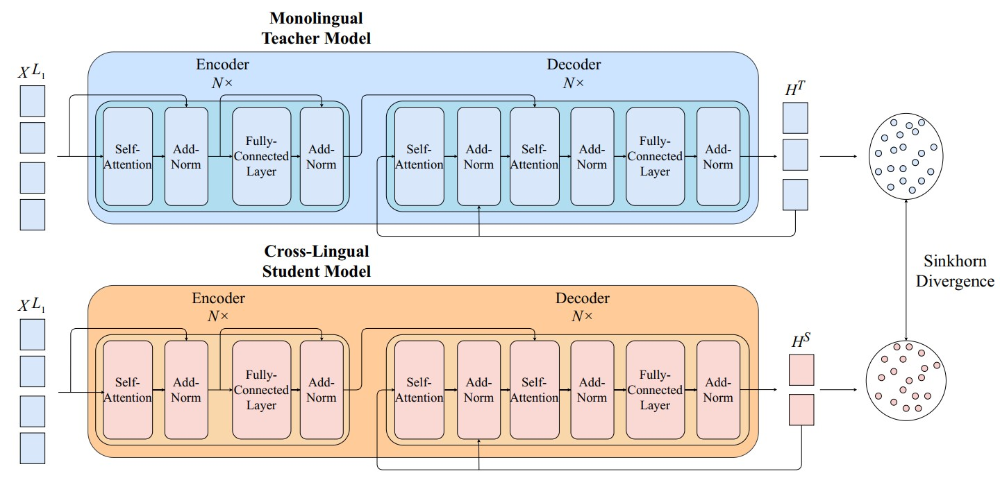

# Improving Neural Cross-lingual Abstractive Summarization via Employing Optimal Transport Distance for Knowledge Distillation
This repository contains the implementation of the paper [Improving Neural Cross-lingual Abstractive Summarization via Employing Optimal Transport Distance for Knowledge Distillation](https://arxiv.org/abs/2112.03473).

[Thong Nguyen](https://nguyentthong.github.io/), [Luu Anh Tuan](https://tuanluu.github.io/) (AAAI 2022)


In this paper, we propose a novel Knowledge Distillation framework to tackle Neural Cross-Lingual Summarization for morphologically or structurally distant languages. In our framework, we propose a novel Knowledge Distillation
framework to tackle Neural Cross-Lingual Summarization for morphologically or structurally distant languages. Extensive experiments in both high and low-resourced settings on multiple Cross-Lingual Summarization datasets that belong to pairs of morphologically and structurally distant languages demonstrate that extensive experiments in both high and low-resourced settings on multiple Cross-Lingual Summarization datasets that belong to pairs of morphologically and structurally distant languages.

```
@article{nguyen2021improving,
  title={Improving Neural Cross-Lingual Summarization via Employing Optimal Transport Distance for Knowledge Distillation},
  author={Nguyen, Thong and Tuan, Luu Anh},
  journal={arXiv preprint arXiv:2112.03473},
  year={2021}
}
```

## Requirements
- python3
- transformers
- pyrouge
- numpy
- pytorch 1.7.0

## How to Run
1. Download and put the dataset in the ```data``` folder: https://drive.google.com/file/d/1bQ0gQuqGOdVf3QTx2WP7Gke1_bo0rtpz/view?usp=sharing
2. Train the monolingual teacher model by running ```./run/continual_NCLS/ncls_train_<l1>2<l2>-<l1>2<l1>.sh```
3. Train the cross-lingual student model through executing ```./run/continual_NCLS/ncls_train_<l1>2<l2>-<l1>2<l2>-ot_loss.sh```
4. Evaluate the cross-lingual student model via executing ```./run/continual_NCLS/ncls_test_<l1>2<l2>-<l1>2<l2>-ot_loss.sh```

## Acknowledgement
Our implementation is based on the official code of [MCLAS](https://github.com/ybai-nlp/MCLAS).